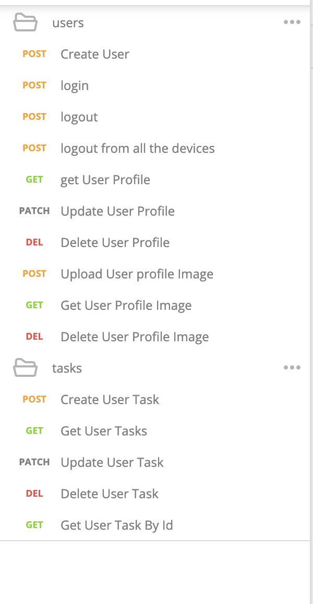

## Task Manager Node js App
this app contains 15 APIs and divided two sections 
Users APIs
User Tasks APIs
for the APIs check [Task Manager APIs.postman_collection(Task-Manager-APIs.postman_collection.json)




## if you want to run the app using docker you can use
i generated two container for [mongodb , current app]
 ```bash
 docker compose up
 ```
 check [docker-compose.yml](docker-compose.yml)


## dependencies
[express](https://www.npmjs.com/package/express)
[mongoose](https://www.npmjs.com/package/mongoose)
[multer](https://www.npmjs.com/package/multer)
[jsonwebtoken](https://www.npmjs.com/package/jsonwebtoken)
[bcryptjs](https://www.npmjs.com/package/bcryptjs)
[validator](https://www.npmjs.com/package/validator)
